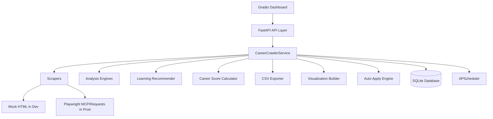

# CareerCrawler

CareerCrawler is an AI-powered job discovery and career intelligence platform focused on safe autonomous development and production-readiness.

Default behavior is **SAFE DEVELOPMENT MODE**:
- `MODE=development`
- `ENABLE_EXTERNAL_SCRAPING=false`
- Scrapers parse local mock HTML under `tests/mock_pages/`
- Real external job website access is blocked

## Key Features

- Scrapes jobs posted in the last 24 hours
- Normalizes and deduplicates job records
- Stores jobs and analytics in SQLite
- Market analysis (skills, salary, companies, geo trends)
- Job ranking with deterministic scoring
- CV + LinkedIn analysis and skill-gap report
- Learning recommendations (YouTube API or deterministic fallback)
- Career Readiness Score (0-100 with interpretation bands)
- CSV export (`jobs_today.csv`, `top_jobs.csv`)
- Optional auto-apply engine (guarded by config)
- Daily scheduled pipeline via APScheduler
- FastAPI backend + Gradio dashboard in one service

## Architecture



## Project Structure

```text
career-crawler/
  backend/
  config/
  scrapers/
  analysis/
  visualization/
  automation/
  learning/
  database/
  frontend/
  llm_provider/
  reports/
  tests/
  Dockerfile
  requirements.txt
  README.md
```

## Configuration

Configuration file: `config/config.yaml`

```yaml
MODE: development
ENABLE_EXTERNAL_SCRAPING: false
AUTO_APPLY: false
LEARNING_RESOURCES_PER_SKILL: 2
LLM_PROVIDER: none
SCHEDULER_CRON: "0 3 * * *"
DATABASE_URL: "sqlite:///./career_crawler.db"
REPORTS_DIR: "reports/output"
MOCK_PAGES_DIR: "tests/mock_pages"
```

### External Scraping Rules

- External scraping is allowed only when both are true:
  - `MODE=production`
  - `ENABLE_EXTERNAL_SCRAPING=true`
- Otherwise real job-site access is blocked by safety guardrails.

## Setup

```bash
git clone <repo-url>
cd career-crawler
python -m venv .venv
source .venv/bin/activate
pip install -r requirements.txt
cp .env.example .env
```

Run app:

```bash
uvicorn backend.main:app --host 0.0.0.0 --port 8000
```

- API docs: `http://localhost:8000/docs`
- Dashboard: `http://localhost:8000/`

## Docker

Build:

```bash
docker build -t career-crawler .
```

Run:

```bash
docker run -p 8000:8000 career-crawler
```

## Onboarding and LLM Modes

On first dashboard launch, onboarding asks whether you have an AI provider.

- If **Yes**:
  - Choose OpenAI, NVIDIA Kimi, or other OpenAI-compatible API
  - Validate credentials with `/v1/models`
  - Persist keys in `.env`
- If **No**:
  - `LLM_PROVIDER=none`
  - Local deterministic analysis mode remains active

## Scheduler

Default daily pipeline schedule: `03:00 UTC` (`0 3 * * *`)

Pipeline steps:
1. Scrape jobs
2. Update DB
3. Analyze market
4. Generate visualizations
5. Compute skill gap
6. Recommend learning resources
7. Calculate readiness score
8. Export CSV
9. Optionally auto-apply

## Testing

```bash
pytest -q
```

Coverage includes:
- Scrapers
- Analysis modules
- API endpoints
- Database operations
- Scheduler registration
- CSV output schema

## API Endpoints (Core)

- `GET /api/health`
- `GET /api/config`
- `POST /api/onboarding/submit`
- `POST /api/scrape`
- `GET /api/jobs`
- `POST /api/analysis/run`
- `GET /api/analysis/latest`
- `POST /api/profile/upload-cv`
- `POST /api/profile/linkedin`
- `GET /api/skill-gap`
- `GET /api/recommendations`
- `GET /api/career-score`
- `POST /api/pipeline/run`
- `POST /api/auto-apply/run`
- `GET /api/reports/{name}`

## Dashboard Preview

Place screenshots under `docs/screenshots/` and reference them here:
- `docs/screenshots/onboarding.png`
- `docs/screenshots/jobs.png`
- `docs/screenshots/insights.png`

## Notes for Open Source Release

- Safe-by-default mode prevents accidental live-site traffic during development.
- Sensitive credentials are persisted in `.env` and excluded from version control.
- Modular structure allows swapping providers and scraper backends.
